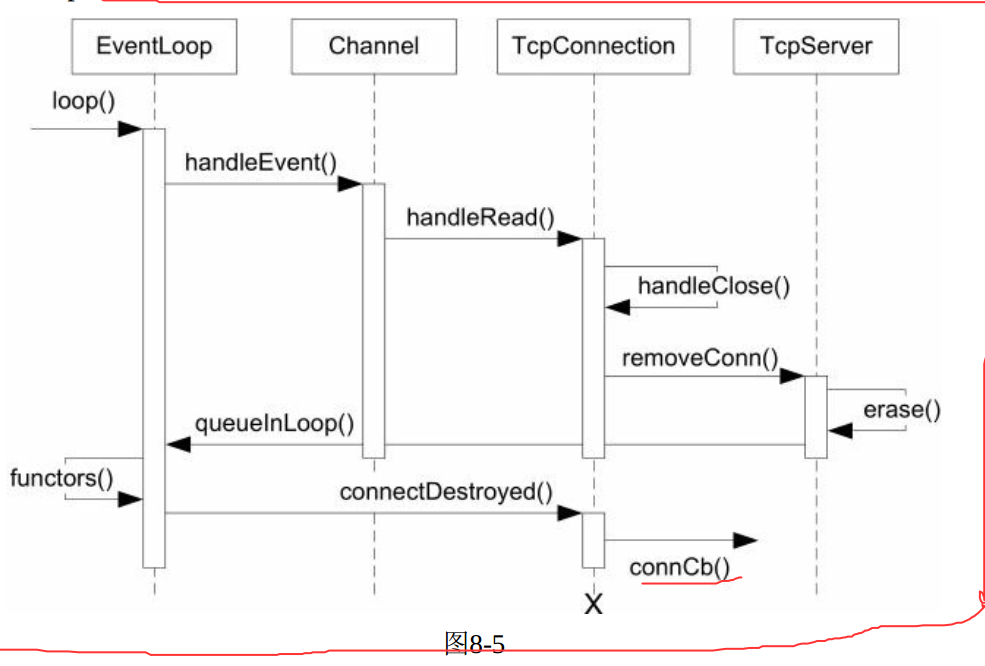

# 记录开发的流程与收获
## 8/3 
1、弄清楚并想清楚项目CMAKE的基本构造 
## 8/4
### 1、写出初始版的什么也不干的eventloop  
比较重要的是one thread per loop，因此eventloop需要方法存储自己属于的线程和判断当前线程。

### 2、对线程进行封装  
编写Thread class包含原始的thread函数，有线程的id，更加方便的运行某个func。
### 3、编写初步的channel  
channel是selectableIO channel，不拥有文件描述符，文件描述符可以是socket、eventfd、timefd、signalfd，
channel可以设置针对不同的时间的回调函数，并且通过handleevent根据发生的时间调用这些回调函数。  
### 4、timestamp照抄过来了
## 8/5
### 4、新增poller  
poll函数中得到io复用的结果，将结果传递给activechannel里，达到IO复用的效果。channel通过 update调用loop的updatechannel更新poller中的事件。
channel有index是为了根据channel快速定位相应的fd在pollfd中的位置。  
### 5、进一步修改eventloop  
在loop中调用poll，在得到的activechannel里执行handleevent，达到执行对应时间的效果  
### 6、timequeue定时器  
linux中有timefd，可以通过IO的方式处理定时，代码一致性更好
编写简单基本的timer（定时器，由定多久时，时间到后发生什么组成）与timerId  
编写timequeue，timequeue的逻辑是对应一个loop和channel，timequeue首先会注册可读的事件，然后将channel的readcallback设置为自己的handleread
，handleread中得到已过期的timer, 进行过期的回调。    
timequeue中add_timer, 供loop中更高层的函数run_after等设置定时器。  
调试纪录：test4_timequeue.cpp出错 : 居然忘记在loop中初始化timequeue了。。。  
### 7、EventLoop::runInLoop函数 
不是线程安全的函数需要assertInLoop()确保在单一线程执行

（1）在EventLoop的IO线程中执行某个用户的任务回调。如果用户在当前IO线程中调用这个函数，回调会同步进行，如果用户在其他线程调用runInLoop()，
使用queueinloop将cb会被加入 队列。IO线程会被唤醒来执行这个Functor。这样可以轻松地在线程间调配任务，比如在对TimeQueue的成员函数调用移到IO线程，这样不用锁也能操作timequeue中的timerlist  
（2）涉及对pendingFunctors_队列的管理，RAII再次封装下mutex。
（3）由于IO线程可能阻塞在poll上， 为了让线程能够立即执行用户回调，我们需要设法唤醒它。使用eventfd比pipe更加高效，添加wakeupfd与wakeupchannel
 (4) 编写queuInloop函数，调用queueinloop的线程不是IO线程，必须唤醒（显然）,IO线程正在调用pendingfunctor时调用queueInLoop，此时必须唤醒
（保证现在queuein的cb能够被执行），只有在IO线程的事件回调中才不需要wakeup();编写doingpendingfunctors
 (5) loop的run_after不一定在loop所属线程执行，而run_after调用的add_timer必须在loop所属线程执行，因此利用runInLoop修改addTimer  
 (6) 定义EventLoopThread， one loop per thread 的本意。  将一个线程与eventloop融合在一起，可以创建一个包含loop的线程。设计有点奇怪，在
stack上定义EventLoop对象，还用条件变量，还使用了条件。主线程创建EventLoopThread，EventLoopThread用线程创建了一个EventLoop对象，在线程中
获取Eventloop对象，这个线程中运行EventLoop循环，而主线程有这个EventLoop的指针可以操作。这个和指针可以用来runInLoop(后续改变channel之类的
操作等，原来是这个用户，神奇)、runAfter、quit之类的函数。
## 8/6
### 8、Acceptor class
(1) 给Acceptor一个loop并创建listen的socket，设置channel的回调，调用listen开始监听（开启socket的监听,开启channel的read），设置好新连接到
来的cb为handleread，handleread中接受连接并且执行新连接的回调，acceptor利用channel等开始监听即可。
(2) 封装下InetAddress，不同情况下用不同的参数初始化一个sockaddr_in。顺便封装socketsops，含有一些socket相关的操作，比如和h2n之类的。
(3) 封装下socket。接收已经创建好的socket fd，封装socket相关的bind、listen、accept函数
### 9、TcpServer接受连接
(1) TcpServer含有一个acceptor，将acceptor的新连接的回调设置为newConnection函数，newConnection函数中利用连接fd建立TcpConnection，
更新Connecmap、并给TcpConnection设置各种回调，调用connectionEstablished，里面会设置tcpConnection的状态、更新channel等，调用
onConnection的回调函数。  
TCPConnection代表建立的一个连接，可以收发数据  
(2) TcpConnection是唯一使用shared_ptr管理、并使用shared_from_this，因为模糊的生命周期。
### 10、TcpConnection关闭连接

比较绕，原因是对象的生命周期管理很重要。比如说，对方断开TCP连接，触发channel::handleEvent()，后者调用用户提供的closeCallback，而用户掉吗在onClose()中可能析构channel对象。
相当于channel::handleEvent()执行到一半时本身所属的Chnnel对象就被销毁了。
(1) Channel改动增加CloseCallBack,channel读到revents会调用
(2) TcpConnection增加CloseCallback，为TcpServer和client准备，用于移除它们的TcpConnectionPtr。增加handleClose作为channel回调函数，
handleclose会做channel相关的disable和调用CloseCallback。
(3) TcpServer添加对TcpConnection设置closeCallBack为removeCollection, removeConnection里会queueInLoop(TcpConnection::connectDestroyed),
原因前几行说过了
(4) EventLoop提供unregister的功能，增加removeChannel函数，调用Poller::removeChannel()
## 8.7
### 11、利用buffer来处理数据输入
buffer是非阻塞TCP编程中必不可少的东西
1、buffer分为三块，prependable、readable、writable，一是scatetr/gather IO，并且一部分缓冲区取自stack，缓存区足够大，一次调用就能取完
全部数据，也不需要使用系统调用去得到tcp缓存有多少数据而预留Buffer的空间；二是只调用一次read，因为采用level trigger，每次读数据只需一次系统调用。
### 12、TcpConnection发送数据
1、之前muduo采用level trigger，因此只在需要时才关注writable事件，否则就会造成busy loop。
2、增加kConnecting状态，增加发送数据send、sendInLoop，逻辑比较复杂
3、关闭的状态和TcpConnectiion::sendInLoop到底怎么控制
调试纪录：test8_tcpserver shared_from_this 出错，因为继承默认是private。
### 13、完善TcpConnection
1、关闭SIGPIPE（这个我居然想到了）,对方断开连接而本地持续写入会造成在断开连接之后继续发送数据的情况。利用C++全局对象忽略这一点。
2、TCP No Delay和TCP keepalive
3、发送数据的速度高于对方接收数据的速度，解决方法是WriteCompleteCallBack和HighWaterMarkCallback，前者是发送区清空时就调用，
在sendInLoop与handleWrite中添加。
## 8.9
### 
### 14、多线程TcpServer
在新建TcpConnection时，从event loop pool中挑选一个loop给TcpConnection，多线程TcpServer自己的EventLoop只用来接受连接，其他新连接会用其
他EventLoop来执行IO。  
1、TcpServer的newConnection函数中初始化TcpConnection时使用从EventLoopPool中得到的loop初始化。  
2、TCPConnection会在自己的io loop中调用removeConnection，需要将他其他TcpServer的loop_线程,确保ConnectionCallback在自己的io loop执行  
3、EventThreadPool中不是一个线程一个Tcp连接，而是可能好多Tcp共享一个线程。
## 8.10
### 15、Connector
负责创立socket，不负责创建TcpConnection(连接成功是否创建tcpconnection取决于connection callback)。newConnectionCallback_代表连接成功
的回调。
几个难点：
(1) socket一次性，但Connector是可以反复使用的，因此每次尝试连接时都要使用新的socket文件描述符和新的channel对象。留意channel对象的生命期管理，
并防止socket文件描述符泄露;  
(2) 错误代码与accept不同，EAGAIN是真的错误，表明ephemeral port暂时用完，要关闭socket在延期重试。正在连接返回EINPROGRESS。出现可写也不一定
意味着连接已成功建立，还需要用getsockopt(socket, SOL_SOCKET, SO_ERROR...)再确认一下；  
(3) 重试的时间逐渐延长，如何管理生命周期，使用EventLoop::runAfter而Connector在定时器到期之前析构了怎么办: 在析构函数cancel定时器  
(4) 处理自连接。source port == detination port  
调试纪录：buffer的readFd居然忘记返回读的字节数了。。。

练习1：改写是s11/test12.cc
1、太多并发连接时出现创建fd失败（收到一个进程创建fd的限制）的问题，使用cout打印完全是乱的，还是需要一个日志系统。  
2、使用400个连接，出现无法正确释放fd，循环退不出的问题，不太清楚，一会又好了  
## 8.11
### 16、TcpClient
与TcpServer类似（都有newCOnnection（新连接来到时）与removeConnection成员函数（要关闭连接时））  
几个要点（从代码中想清楚怎么实现的）  
（1）能够断开之后重连，并且本身Connector具有反复尝试连接的功能：removeConnection里可以选择重新连接  
（2）连接断开后初次重试的延迟应该具有随机性，比如服务器突然彭奎，所有用户断开后马上发生连接，此时连接造成丢包、服务器负载压力大，因此TcpClient应该
等待一段随机的时间：Connector里restart可以轻松设置时间  
（3）发生SYN丢包，系统默认重试时间是3s：在Connector中利用定时器在0.5s或1s后发起连接  
（4）目前没有充分测试动态增减即没TcpClient周期比EventLoop短的情况。
### 17、epoll  
epoll与poll的不同在于poller需要用整个vector<struct pollfd> PollFdList pollfds_维护所有的fd结构，修改元素需要对pollfds_里的元素修改
而epoll只需用vector<struct epoll_events> EventList维护返回的活动的fd列表,修改fd关注事件直接对fd操作即可。epoll和poll操作上很大的不同了

